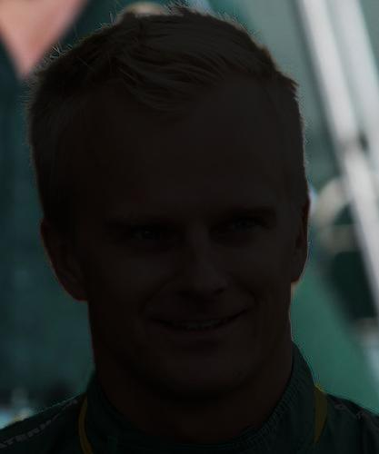
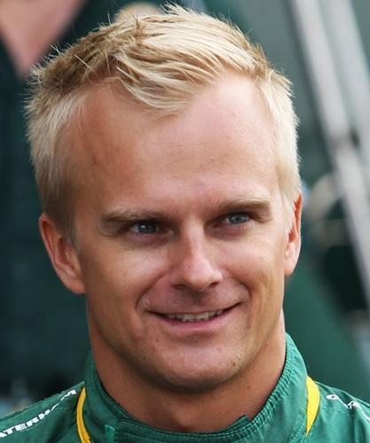
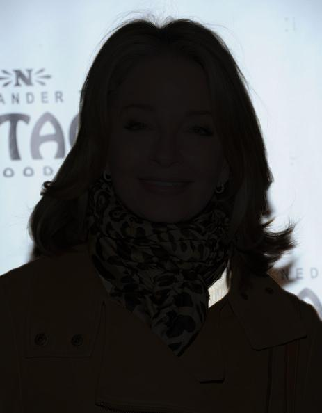
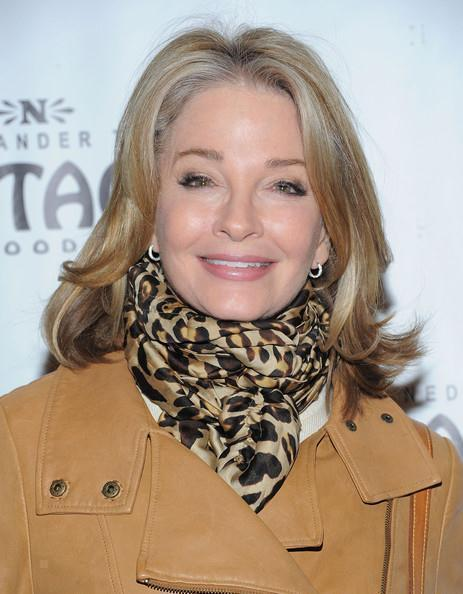
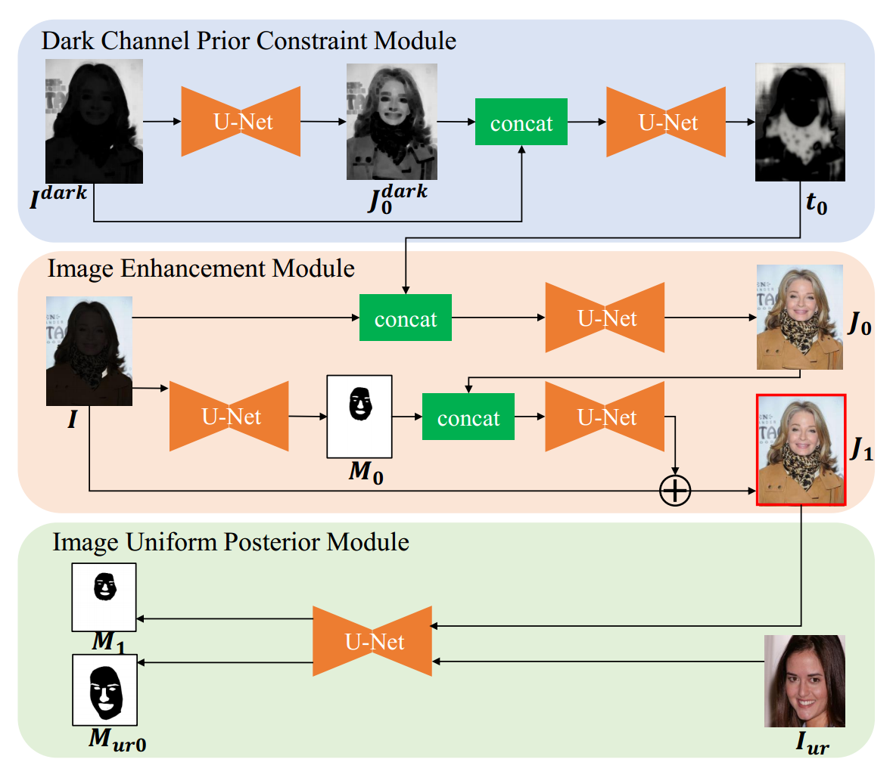

# Face Relight

<div style="text-align:center;">
  <div style="display: inline-block;">
    
  </div>
  <div style="display: inline-block;">
    
  </div>
  <div style="display: inline-block;">
    
  </div>
  <div style="display: inline-block;">
    
  </div>
</div>

# Our Models

<div style="text-align:center;">
  
</div>


- ***Build lightweight U-net model, weight file < 15MB, less resource consumption***；

- ***The U-net model used includes:***

  1. The dark channel prior constraint module is mainly used for image brightness analysis and dark channel generation
constraints. 

  2. The image enhancement module mainly targets the enhancement of the image, which is based on the dark channel
prior constraint. 

  3. The image uniform posterior module is mainly used to
constrain the results of our reconstruction enhancement by
the generated results of other uniformly illuminated images.


- ***Validation can be evaluated on RTX1080Ti；***

## Algorithm comparison

|       Model       |    PSNR     |  SSIM  |    NIQE     |   il-NIQE   |
|:-----------------:|:-----------:|:------:|:-----------:|:-----------:|
|        NPE        |    14.88    | 0.7300 |    15.92    |    45.39    |
|       SEIR        |    12.49    | 0.6455 |    15.30    |    49.02    |
|      DeepUPE      |    16.08    | 0.7122 |    15.39    |    50.95    |
|   EnlightenGAN    |    14.83    | 0.7273 |    15.50    |    44.68    |
|     Zero-DCE      |    15.71    | 0.7564 |    15.72    |    44.98    |
|    DeepRelight    |    10.65    | 0.5845 |    15.42    |    56.45    |
|      ST-CGAN      |    13.26    | 0.6213 |    18.24    |    50.21    |
|    <b>Ours</b>    | <b>28.16<b> | <b>0.8910<b> | <b>15.20<b> | <b>44.17<b> |


## Datasets

The simulation data used for training is from dataset CelebA, where we extract the foreground 𝑀𝑠 , and the background information 𝑀𝑏 by the matting algorithm:
𝐼 = 𝑀𝑏 + 𝜃𝑀𝑠 where 𝜃 is the balance parameter of the foreground 𝑀𝑠 and background 𝑀𝑏
, and its value range is set to a random number between [0.1, 0.2]. The input image is simulated and
the original image is used as the target image for training. All training data are tuned to 512 × 512. In addition, the training
data used to uniformly express the posterior constraints during training are CelebAMask-HQ and its mask data that 
does not overlap with the training test data. 

You can refer to the following links to download the [baidupan](https://pan.baidu.com/s/148vbPR5qiM4nVWC1Z44_gw?pwd=qi2d ) datasets  
Or configure the data set yourself
[CelebA Datasets](https://mmlab.ie.cuhk.edu.hk/projects/CelebA.html)
[CelebAMask-HQ](https://github.com/switchablenorms/CelebAMask-HQ)


### Environmental dependence

- torch
- torchvision
- torchsummary
- tqdm
- opencv-python


### Prepare for datasets

Download the [baidupan](https://pan.baidu.com/s/148vbPR5qiM4nVWC1Z44_gw?pwd=qi2d) datasets, and put them in the root directory `face-relight` folder.
The file structure is shown below:

```
/train_data
├── backlit_face
│   ├── 000013.jpg
│   ├── 000013.jpg
│   └── 000013.jpg
└── backlit_face_darkc
│   ├── 000013.jpg
│   ├── 000013.jpg
│   └── 000013.jpg
└── target_face
│   ├── 000013.jpg
│   ├── 000013.jpg
│   └── 000013.jpg
└── target_face_darkc
│   ├── 000013.jpg
│   ├── 000013.jpg
│   └── 000013.jpg
└── target_face_mask
│   ├── 000013.jpg
│   ├── 000013.jpg
│   └── 000013.jpg
└── siam_face
│   ├── 000013.jpg
│   ├── 000013.jpg
│   └── 000013.jpg
└── siam_face_mask
│   ├── 000013.jpg
│   ├── 000013.jpg
│   └── 000013.jpg

/test_data
├── backlit_face
│   ├── 105780.jpg
│   ├── 105786.jpg
│   └── 105790.jpg
└── backlit_face_darkc
│   ├── 105780.jpg
│   ├── 105786.jpg
│   └── 105790.jpg
└── target_face
│   ├── 105780.jpg
│   ├── 105786.jpg
│   └── 105790.jpg
└── target_face_darkc
│   ├── 105780.jpg
│   ├── 105786.jpg
│   └── 105790.jpg
```

### Train models

```python
python train.py
```


### Test Images

The images to be tested are placed in  `test_image`. The file structure is shown below:

```
/test_image
│── 000018.jpg
│── 000019.jpg
└── 000020.jpg

```

Configure the trained `.pth` file path in test.py 

And test for images
```python
python test.py
```

You can see the test results under the folder `results_test`


